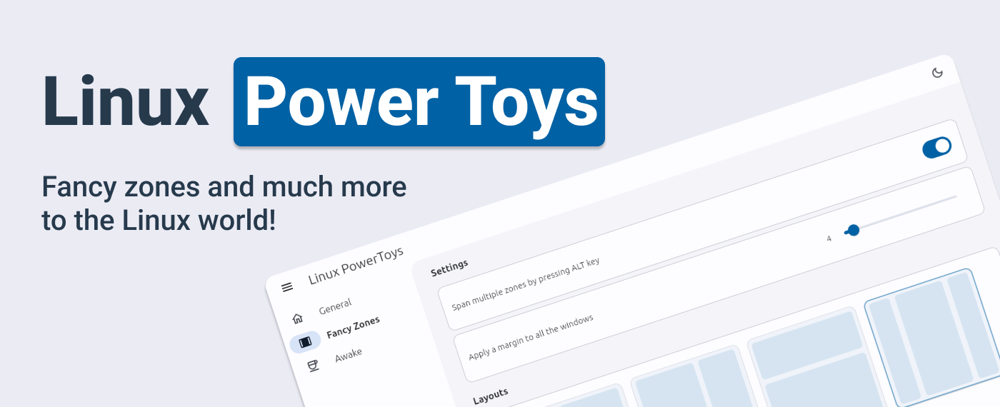

# Linux PowerToys



_🚧 Get Microsoft's PowerToys utilities and much more to Linux world! This project is currently in a very early stage of development. Right now it is a prototype which demonstrates the feasibility of the concept._

## About

Linux PowerToys brings a set of utilities to tune and streamline Linux experience for greater productivity.

|                       | Utilities                                                                                                                                                                                                                                                                                                                                                                                                                   |
|-----------------------|-----------------------------------------------------------------------------------------------------------------------------------------------------------------------------------------------------------------------------------------------------------------------------------------------------------------------------------------------------------------------------------------------------------------------------|
| **Awake**             | Keep the computer awake without having to manage its power & sleep settings. This behaviour can be helpful when running time-consuming tasks, ensuring that the computer does not go to sleep or turn off its screens.                                                                                                                                                                                                      |
| **FancyZones**        | Window management utility that organizes and snaps windows into efficient layouts to enhance workflow speed and quickly restore layouts. FancyZones allows you to define a set of zone positions to use as destinations for windows on the desktop. When dragging a window into a zone or using the associated shortcut key, the window is resized and repositioned to fit that zone. [Learn more...](./doc/FANCY_ZONES.md) |
| **Run**               | To be implemented...                                                                                                                                                                                                                                                                                                                                                                                                        |
| **Rename**            | To be implemented...                                                                                                                                                                                                                                                                                                                                                                                                        |
| **Hosts File Editor** | To be implemented...                                                                                                                                                                                                                                                                                                                                                                                                        |
| **Mouse utilities**   | To be implemented...                                                                                                                                                                                                                                                                                                                                                                                                        |
| **Quick Accent**      | To be implemented...                                                                                                                                                                                                                                                                                                                                                                                                        |
| **Text Extractor**    | To be implemented...                                                                                                                                                                                                                                                                                                                                                                                                        |
| **Image Resizer**     | To be implemented...                                                                                                                                                                                                                                                                                                                                                                                                        |
| **Color Picker**      | To be implemented...                                                                                                                                                                                                                                                                                                                                                                                                        |

## Project Attribution: Inspiring the Creation of Linux PowerToys

**Linux PowerToys**, is an open-source initiative aimed at bringing the utilities of Microsoft PowerToys and more to the Linux world. However, it is important to note that this project is not affiliated with or endorsed by Microsoft in any way. It is not a porting effort but a complete reimplementation from scratch. The original Microsoft PowerToys does not support Linux, and therefore, a porting process is not feasible.

While the concept and inspiration for this project come from Microsoft PowerToys, the development, design, and implementation of Linux PowerToys are entirely independent and community-driven. We would like to express our gratitude to the Microsoft PowerToys project for inspiring us to create this project for the Linux community.

Please note that Linux PowerToys is licensed under the GPLv2 license. Any usage, distribution, or modification of the project should comply with the terms and conditions specified in the license.

## Getting Started

These instructions will get you a copy of the project up and running on your local machine for development and testing purposes.

### Prerequisites

This software requires Flutter and Dart. Get started on [Flutter website](https://docs.flutter.dev/get-started/install)

## Run in debug mode

```
make run-debug
```

## Contributing

Please read [CONTRIBUTING.md](https://github.com/domferr/Linux-PowerToys/blob/main/CONTRIBUTING.md) for details on our code of conduct, and the process for submitting pull requests to us.

## Authors

* **Domenico Ferraro** - [GitHub profile](https://github.com/domferr)

See also the list of [contributors](https://github.com/domferr/Linux-PowerToys/graphs/contributors) who participated in this project.

## License

This project is licensed under the GPLv2 License - see the [LICENSE](https://github.com/domferr/Linux-PowerToys/blob/main/LICENSE) file for details

## Acknowledgments

* Feel free to reach us if you want to contribute to our project! Please read [CONTRIBUTING.md](https://github.com/domferr/Linux-PowerToys/blob/main/CONTRIBUTING.md) for details on our code of conduct, and the process for submitting pull requests to us.
