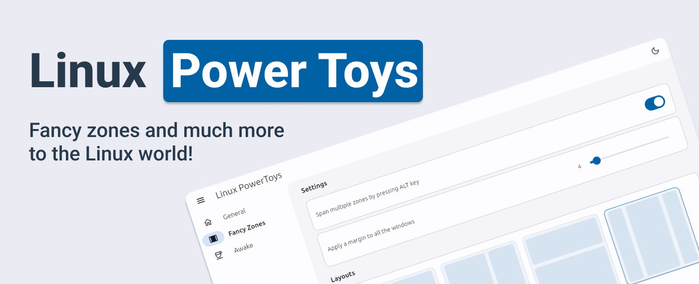

# Linux PowerToys


[]([https://ko-fi.com/domferr](https://github.com/domferr/tilingshell/releases))


[](https://ko-fi.com/domferr)
[](https://patreon.com/domferr)

> [!IMPORTANT]
>  This project is currently in a very early stage of development. 🚧 Get Microsoft's PowerToys utilities and much more to Linux world! This project is not affiliated with or endorsed by Microsoft in any way. It is not a porting effort, but a _complete reimplementation from scratch_. Currently supports GNOME desktop environment only.

Have issues, you want to suggest a new feature or contribute? Please open a new [issue](https://github.com/domferr/Linux-PowerToys/issues)!

## Utilities

Linux PowerToys brings a set of utilities to tune and streamline Linux experience for greater productivity.

|   | Utilities | Platform Support |
|---|---|---|
| **Awake**             | Keep the computer awake without having to manage its power & sleep settings. This behaviour can be helpful when running time-consuming tasks, ensuring that the computer does not go to sleep or turn off its screens.                                                                                                                                                                                                      | GNOME only |
| **FancyZones**        | Window management utility that organizes and snaps windows into efficient layouts to enhance workflow speed and quickly restore layouts. FancyZones allows you to define a set of zone positions to use as destinations for windows on the desktop. [Learn more...](./doc/FANCY_ZONES.md) | GNOME only |
| **Snap Assistant**    | The Snap Assistant tool will appear moving the window on top of the screen. You can choose where to place and how to resize the window. | GNOME only |
| **Color Picker**      | A system-wide color picking utility for Linux to pick colors from any screen and copy it to the clipboard. | GNOME only |
| **To be implemented...**            | Rename, Run, Mouse utilities, Quick Accent, Text Extractor, Image Resizer. You want to suggest a new feature or contribute? Please open a new [issue](https://github.com/domferr/Linux-PowerToys/issues)! | |

## Usage
Download the [latest](https://github.com/domferr/Linux-PowerToys/releases) release and enjoy! Install the utilities you want, and then you can enable them and change their settings.

### Fancy Zones ###

When grabbing and moving a window, press <kbd>CTRL</kbd> key to show the tiling layout. When moving on a tile, it will highlight. Ungrab the window to place that window on the highlighted tile. [Learn more...](./doc/FANCY_ZONES.md)

[tiling_system.webm](https://github.com/domferr/modernwindowmanager/assets/14203981/a45ec416-ad39-458d-9b9f-cddce8b25666)

### Fancy Zones Editor ###
> <kbd>LEFT CLICK</kbd> to split a tile. <kbd>LEFT CLICK</kbd> + <kbd>CTRL</kbd> to split a tile _vertically_. <kbd>RIGHT CLICK</kbd> to delete a tile.

[layout_editor.webm](https://github.com/domferr/modernwindowmanager/assets/14203981/c6e05589-69d9-4fa3-a4df-61ee875cf9e1)

### Snap Assistant ###
When grabbing and moving a window, the snap assistant will be available on top of the screen. Move the window near it to activate the snap assistant. While still grabbing the window, move your mouse to the tile you are interested in. By stopping grabbing the window will be tiled to the selected tile!

[snap_assistant.webm](https://github.com/domferr/modernwindowmanager/assets/14203981/33511582-fa92-445e-b1ba-8b08f9a8e43a)

### Color Picker ###
A system-wide color picking utility for Linux to pick colors from any screen and copy it to the clipboard.


# Development
### Prerequisites

This software requires Flutter and Dart. Get started on [Flutter website](https://docs.flutter.dev/get-started/install)

### Run in debug mode

```
make run-debug
```

## Contributing

Please read [CONTRIBUTING.md](https://github.com/domferr/Linux-PowerToys/blob/main/CONTRIBUTING.md) for details on our code of conduct, and the process for submitting pull requests to us.

## Authors

* **Domenico Ferraro** - [GitHub profile](https://github.com/domferr)

See also the list of [contributors](https://github.com/domferr/Linux-PowerToys/graphs/contributors) who participated in this project.

## License

This project is licensed under the GPLv2 License - see the [LICENSE](https://github.com/domferr/Linux-PowerToys/blob/main/LICENSE) file for details

## Acknowledgments

* Feel free to reach us if you want to contribute to our project! Please read [CONTRIBUTING.md](https://github.com/domferr/Linux-PowerToys/blob/main/CONTRIBUTING.md) for details on our code of conduct, and the process for submitting pull requests to us.
