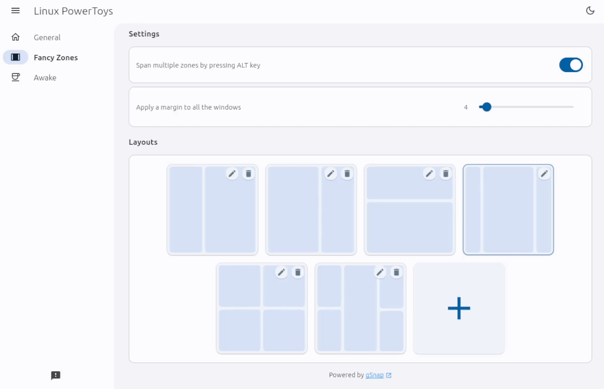
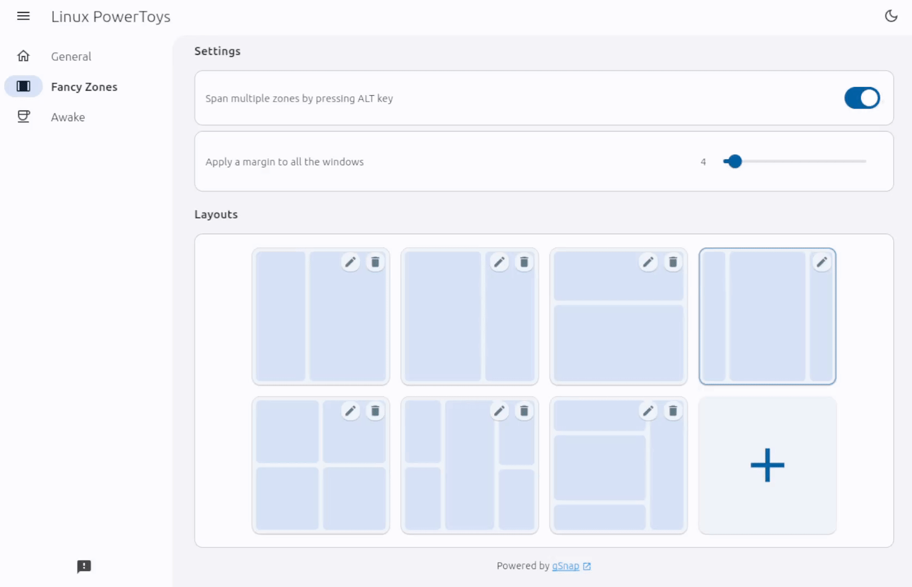
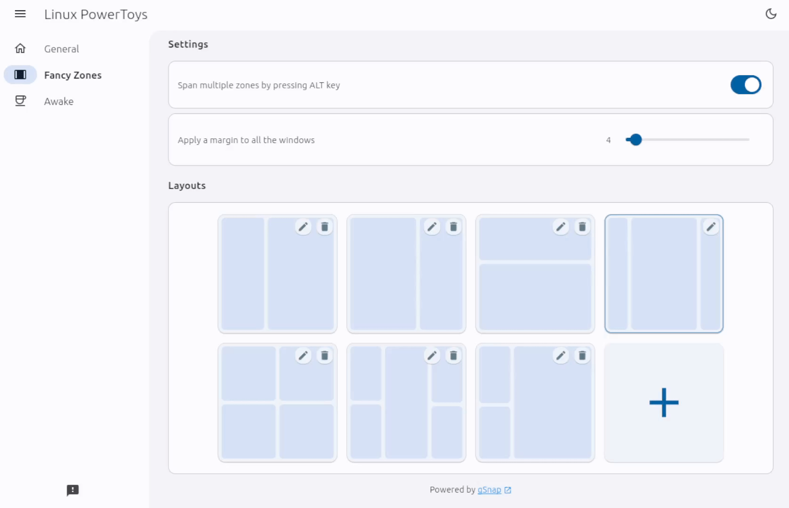

# Linux PowerToys | Fancy Zones
Experience the power of FancyZones, an innovative window manager that enables advanced window layout customization. Effortlessly organize and snap windows into predefined zones to enhance productivity and streamline multitasking on your Linux desktop.

## Layout Builder
The Layout Builder is a powerful feature of Linux PowerToys that allows you to create, edit, and remove layouts with ease.
With this tool, you can customize your window arrangements and optimize your productivity. 
Let's explore the three main functionalities of the Layout Builder: creation, editing, and deletion.

These are the commands to fine-tune your layouts and achieve the perfect window arrangement for your tasks:
- **Left-click**: Left-clicking on a zone allows you to split it horizontally into two zones.
- **Left-click + Shift**: Holding down the left mouse button and pressing Shift on a zone enables vertical splitting into two zones.
- **Right-click**: Right-clicking on a zone allows you to delete it.

### Creating a Layout
To create a layout, follow these simple steps:

### Edit an existing layout
If you want to modify an existing layout, the Layout Builder makes it a breeze:

### Removing a Layout
If you no longer need a particular layout, you can easily remove it:

Note: you cannot remove the currently selected layout.
